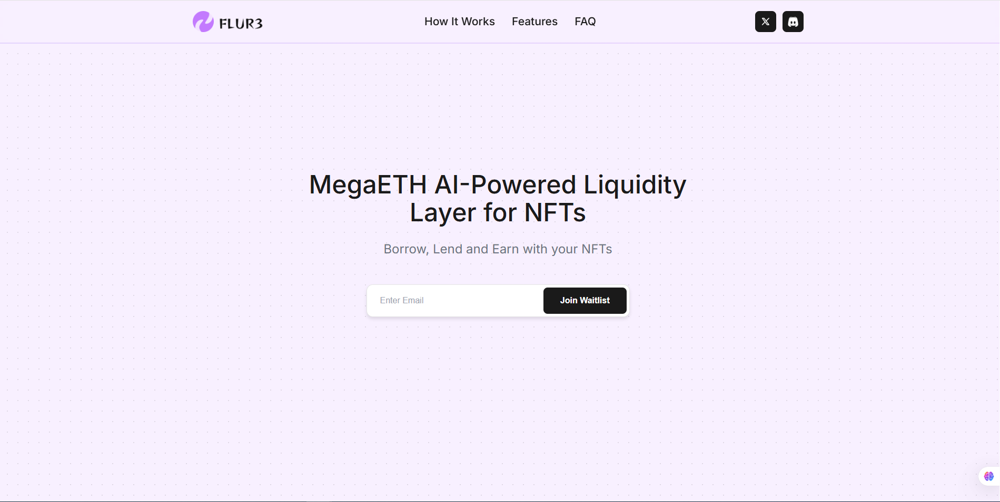

# FLUR3 — AI‑Powered Liquidity Layer for NFTs

<p align="center">
  
</p>

<p align="center">
  <b>Telegram:</b> <a href="https://t.me/lorine93s">@lorine93s</a>
</p>

## Overview
FLUR3 is a React + TypeScript (Vite) demo showcasing an AI‑powered NFT money market. It focuses on clean UX for Borrow/Lend/Earn, professional theming, responsive components, and Web3‑ready sections that can be wired to Solana/EVM/Sui backends.

## Features
- Borrow/Lend/Earn hero with waitlist capture
- Sections: How It Works, NFT Showcase, Unique Features, FAQ, Footer
- Professional styling with micro‑interactions and responsive layout
- Image assets served from `public/image` (NFTs, social icons, product art)

## Tech Stack
- React 18, TypeScript, Vite
- CSS (component‑scoped styles via `dangerouslySetInnerHTML`), utility classes in `src/index.css`
- Icons: lucide‑react

## Getting Started
```bash
npm install
npm run dev
# open http://localhost:5173
```

## Project Structure
```
src/
  components/
    Header.tsx       # logo, nav, social, (theme line)
    Hero.tsx         # headline + waitlist form
    HowItWorks.tsx   # borrow/lend/earn explainer
    NFTShowcase.tsx  # responsive NFT grid/stack
    UniqueFeatures.tsx
    FAQ.tsx
    Footer.tsx
  App.tsx
  index.css
  main.tsx
public/
  image/             # logo, nft images, social icons, cover.png
```

## Roadmap
- Wallet integration (Solana/EVM), risk engine API, and order routing
- Strategy/agent hooks for AI‑assisted flows

## Author
- Aram Petrosyan — Telegram: `@lorine93s` — Email: `xsui46941@gmail.com`

---

<!-- Repository metadata suggestions -->
<!-- Description: AI‑powered NFT money market demo. Borrow/Lend/Earn UX, Solana/EVM‑ready UI, and Web3‑first components with professional theming and micro‑interactions. -->
<!-- Topics: web3, blockchain, solana, evm, ethereum, sui, nft, defi, dao, launchpad, perps, trading-bot, sniper-bot, bundler, volume-bot, react, typescript, vite, tailwind, framer-motion, ai, ai-agent, walletconnect, anchor, ethersjs, metaplex -->